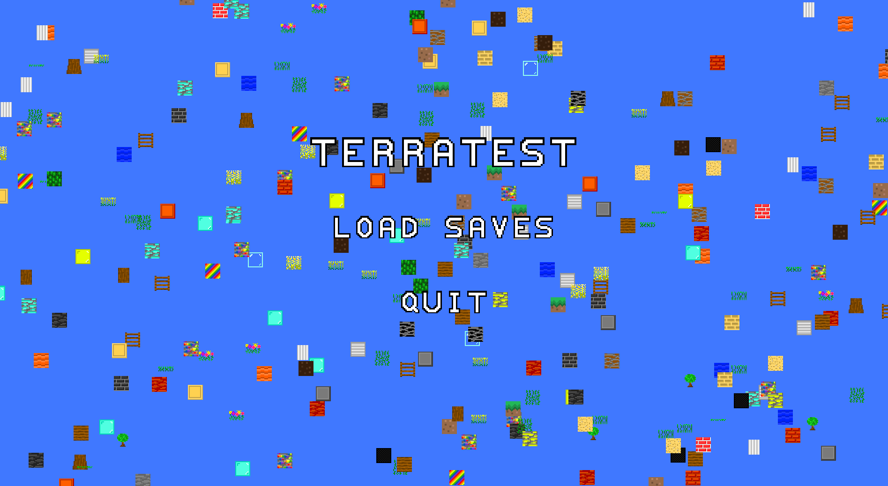
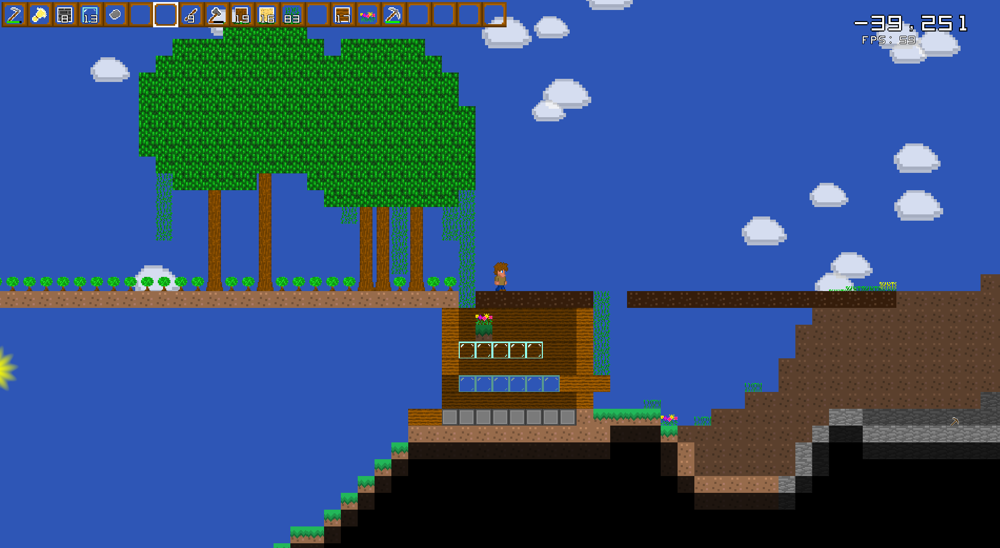
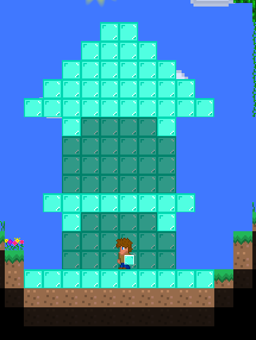

# TerraTest

This is a Terraria clone that I wrote as a programming challenge.

A lot of the code is messy and rather poorly organized and the 
performance/resource usage of the game isn't good at times but
I plan on fixing that in the future.

## Libraries Used
[GLFW](https://github.com/glfw/glfw)

[glad](https://github.com/Dav1dde/glad)

[SOIL2](https://github.com/SpartanJ/SOIL2)

## Build
`
git clone --recursive https://github.com/JLi69/terratest
`

(make sure that you have the dependencies to the libraries used
installed on your system)

### Linux:

Tested with gcc but should build with other compilers.

```
cd terratest
mkdir build
cd build
cmake ..
make
```

### Windows:
I built this with MinGW-w64 but I don't believe that this
will work with MSVC as I used some unix headers in some
parts of the game.

```
cd terratest
mkdir build
cd build
cmake .. -G "MinGW Makefiles"
mingw32-make
```

## TODO
I don't intend on working on this project for a while as I want to
work on other projects but this is a list that I plan on using when
adding new features to the game later when I want to work on this
again. If you have any suggestions/find bugs/have feedback, please
open an issue to discuss it.

Additionally, forks/pull requests are encouraged.

 - Fix any bugs in the game
 - Improve performance
	- Make optimizations to keep frame rate stable
	- Optimize OpenGL to use less CPU
	- World chunking to reduce memory usage/improve performance
 - Quality of Life
	- More easily rearrange inventory
	- Better UI design
	- Improved crafting menu
 - Add new features
	- More enemies
	- New blocks
		- Utility blocks such as chests/furnace
	- Biomes
		- Snow biome
		- Desert biome
 - Lua support?

## Screenshots




## License
All code (shaders/source code) is under the MIT license.

Assets (images) are public domain.
